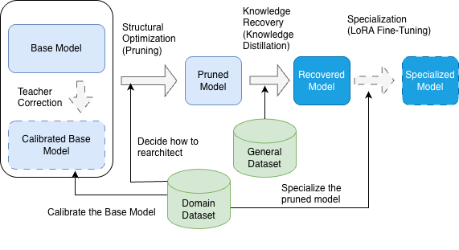

# Tailoring LLM Architectures. 
**Surgical Optimization Beyond Fine-Tuning**

---

Tailoring LLM Architectures addresses the growing need for AI professionals who understand how LLMs work at a fundamental level—professionals who can create hyper-efficient models tailored to specific data and tasks rather than relying on one-size-fits-all solutions.

The industry is shifting away from generic, closed-source models toward open-source alternatives that offer better stability, data privacy, lower operational costs, and competitive differentiation that proprietary APIs cannot provide. However, this transition faces a critical bottleneck: a shortage of engineers equipped with the deep architectural knowledge required to optimize these models effectively.

The book teaches **optimization techniques** for transforming large pre-trained models into efficient Small Language Models (SLMs). These methodologies—including depth pruning, width pruning in GLU architectures, and knowledge distillation—are similar to approaches used by companies like [**Nvidia**](https://arxiv.org/abs/2407.14679) (Minitron family) and [**Mistral**](https://arxiv.org/abs/2601.08584) (Ministral family) to create production-ready model families.

Beyond these foundational techniques, the book introduces **original methodologies** like Fair Pruning (bias-aware optimization) and Adaptive Attention Bypass (dynamic inference), combining industry best practices with cutting-edge research. You'll learn to apply all these techniques to open-source models like Llama, Gemma, and Qwen, with hands-on notebooks that run on Google Colab's free tier.

* Surgically optimize model architectures through depth and width pruning
* Recover lost knowledge using targeted distillation techniques
* Specialize models for your specific domain and use case
* Measure and validate every optimization decision 

*The Tailoring Pipeline. The domain-specific dataset guides the calibration of the base model, informs structural optimization decisions, and drives the final specialization through LoRA fine-tuning. A general dataset supports Knowledge Recovery, ensuring the pruned model retains broad capabilities before domain-specific specialization. This dual approach optimizes each phase for the project's specific objectives.*

## 🧠 Your Interactive Technical Companion: NotebookLM Space

**Start experimenting interactively.**

This NotebookLM space contains all the research papers, chapter notebooks, and optiPfair guides in a conversational format. Think of it as your AI-powered technical assistant for the book, which helps you to become an LLM architect. 

**What you can do:**
- **Ask specific questions**: "How does depth pruning work?" or "How many layers can I remove from a 70B model?"
- **Get code snippets**: "Show me the code to reduce the GLU expansion of Llama3"
- **Explore techniques**: Query any pruning, distillation, or optimization method
- **Troubleshoot**: Get help understanding implementation details from the notebooks

Perfect for:
- Quick reference while coding
- Understanding paper implementations
- Exploring techniques before diving into chapters
- Clarifying concepts on the go

**[→ Launch NotebookLM Space](https://notebooklm.google.com/notebook/a059766a-14bf-4d75-8840-b05a79be680e)**

> 💡 **Pro tip**: Use NotebookLM for quick queries and experimentation. For structured, in-depth learning, the book remains your best companion.

Stop being a mere user. It's time to become an architect.

## 🌟 Support This Project

If you find these techniques useful, consider:
- ⭐ Starring this repo to stay updated
- 🔄 Sharing it with your team
- 💬 Opening Discussions with your questions

Every star helps us reach more LLM engineers who can benefit from this work.
